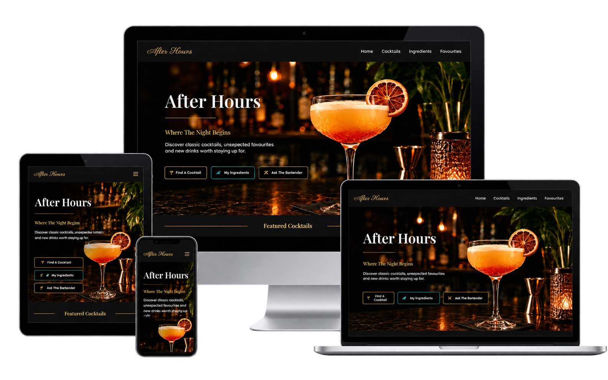

# After Hours

After Hours is an interactive cocktail website designed for adults who want to explore cocktails, discover drinks based on ingredients they already have, save their favourite cocktails, and receive personalised cocktail recommendations.

The project was developed using React and JavaScript, with cocktail data provided by TheCocktailDB API and an AI-powered bartender feature using Google's Gemini API.

The overall concept was to create the atmosphere of a dark, luxurious tropical cocktail bar while combining this visual experience with practical cocktail discovery tools.

## Contents

- [Overview](#overview)
- [UX / User Stories](#ux--user-stories)
- [Features](#features)
- [Design](#design)
- [Technologies Used](#technologies-used)
- [Development](#development)
- [Testing](#testing)
- [Deployment](#deployment)
- [Credits](#credits)
- [Future Development](#future-development)
- [Reflection](#reflection)
- [AI Mentoring Evidence](#ai-mentoring-evidence)

## Overview

After Hours is an interactive cocktail website designed to help users discover and explore cocktails in a visually engaging way.

Users can search for cocktails by name, find cocktails based on ingredients they already have, view detailed cocktail information, save favourites, and interact with an AI-powered bartender for personalised recommendations.

The project was developed using React and JavaScript. Cocktail information is provided by TheCocktailDB API, while Google's Gemini API powers the conversational bartender feature.

The site was designed around the concept of a dark, luxurious tropical cocktail bar. The visual design combines atmospheric imagery, gold accents and teal tones to create an immersive evening-bar aesthetic while keeping the interface practical and accessible across different screen sizes.

## UX / User Stories

### Target Audience

After Hours is aimed at adults who enjoy cocktails and want an engaging way to discover drinks, explore recipes and find cocktails based on ingredients they already have available.

The site is also intended for users who enjoy experimenting with cocktails and would like personalised recommendations or ingredient substitution suggestions.

### User Stories

The following user stories were defined during the planning and development of After Hours.

#### Search for a Cocktail

> As a user, I want to search for a cocktail by name so that I can quickly find a specific drink I'm interested in.

#### Browse Featured Cocktails

> As a user, I want to browse featured alcoholic and non-alcoholic cocktails so that I can discover drinks without having to search for a specific cocktail.

#### View a Recipe

> As a user, I want to view a cocktail's ingredients, measurements and preparation instructions so that I can make the drink.

#### Save Favourites

> As a user, I want to save cocktails as favourites so that I can easily find recipes I want to try again.

#### Find Cocktails by Ingredients

> As a user, I want to enter ingredients I have available so that I can find cocktails I can make with what I already have.

#### Surprise Me

> As a user, I want to receive random alcoholic and non-alcoholic cocktail suggestions so that I can discover something new when I don't know what to choose.

### Additional Feature — AI Bartender

The AI Bartender was introduced later in development as an additional feature rather than one of the original Project Board user stories.

It provides a conversational way for users to ask for cocktail recommendations and advice, including suggestions based on preferences and ingredient substitutions when an ingredient is unavailable.

#### Surprise Me

The original Surprise Me user story proposed a dedicated feature
displaying random alcoholic and non-alcoholic cocktails.

During development, this evolved into a standalone Surprise Me
button within the AI Bartender. Clicking the button populates
the chat input with a surprise cocktail request, allowing users
to discover a new cocktail without knowing what to search for.

The feature was successfully tested, although the original
two-category recommendation interface was not implemented.

### Wireframes

Wireframes were created for all pages and required responsive breakpoints during the planning stage of the project.

The wireframes were used to establish the initial structure, content hierarchy and responsive layout of the website before development began.

The final implementation evolved from the original wireframes as development progressed. Responsive testing, API functionality and usability testing resulted in some changes to layouts and positioning.

The complete set of wireframes is included below.

#### Homepage

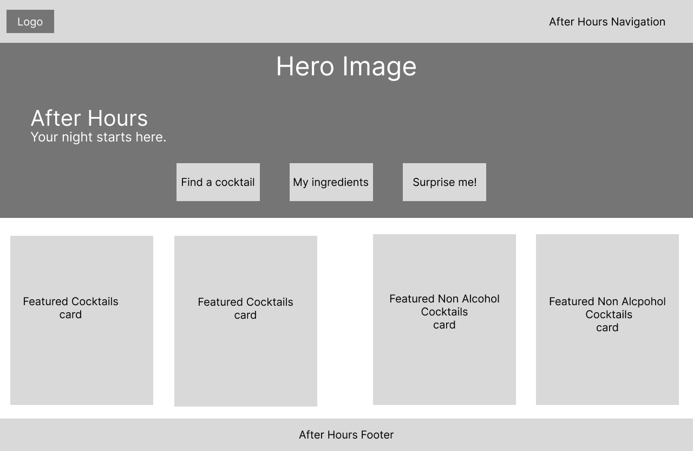

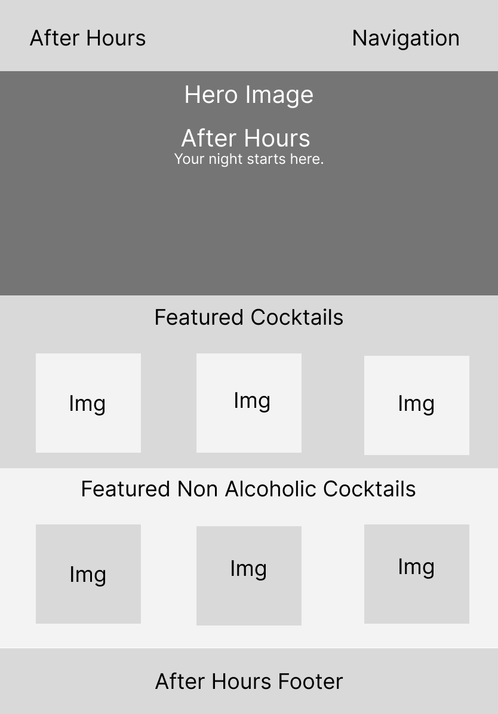

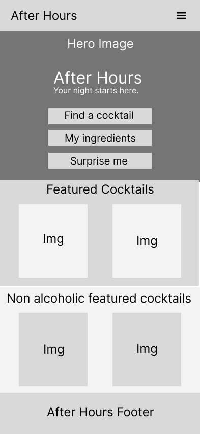

#### Search Cocktails

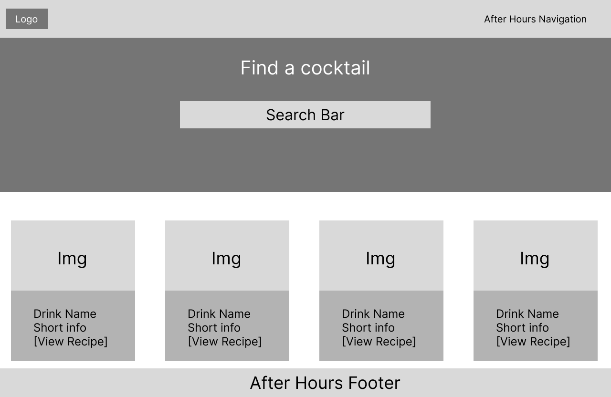

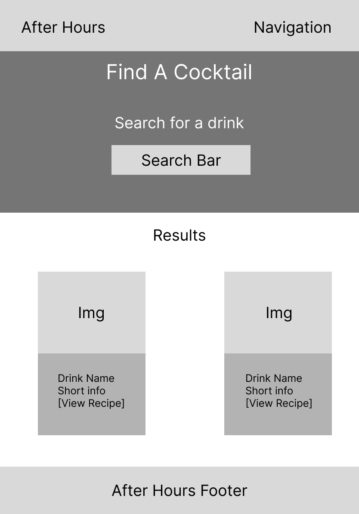

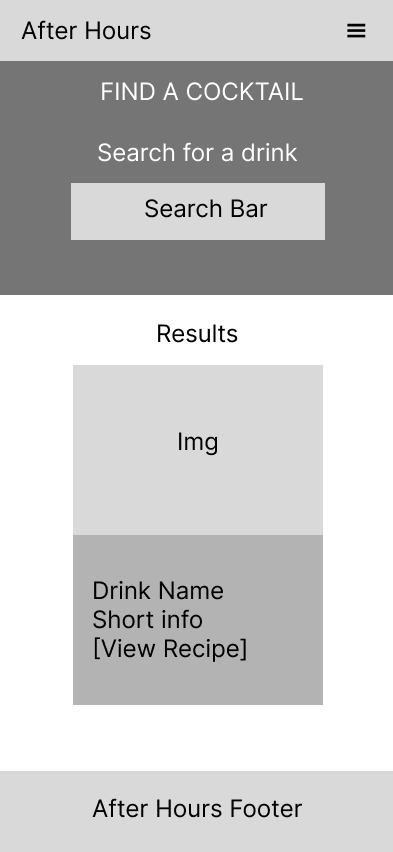

#### My Ingredients

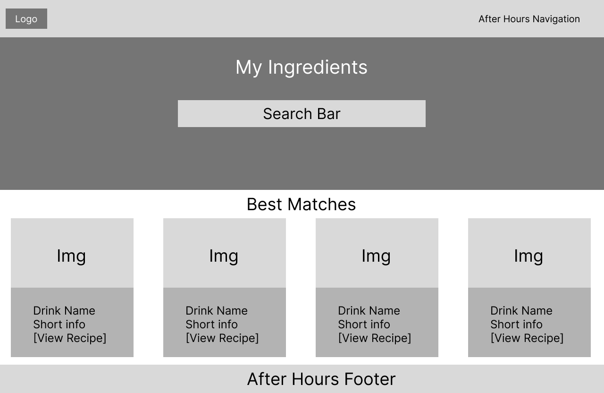

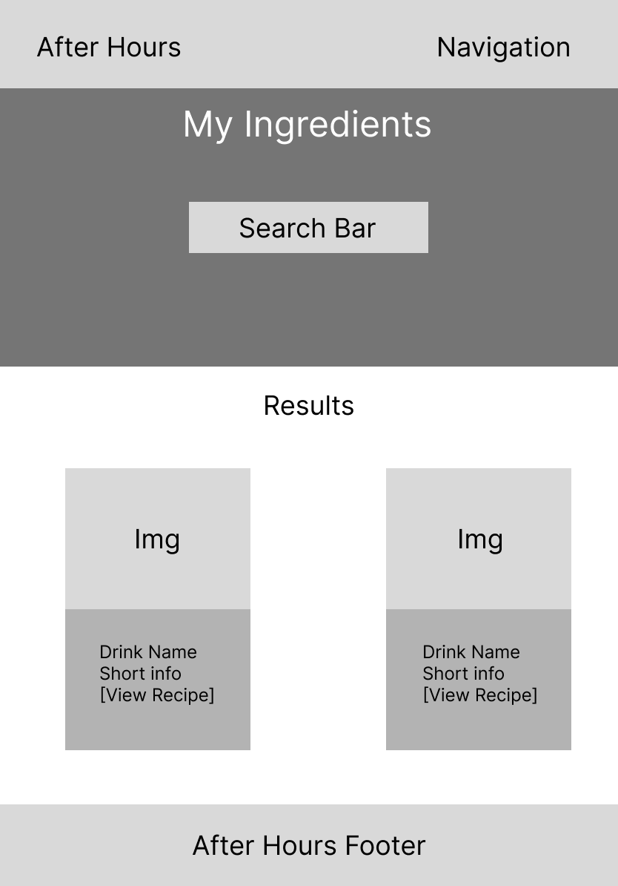

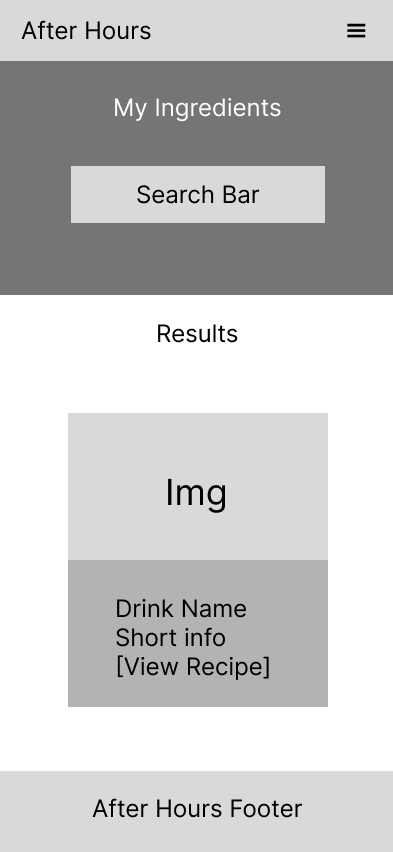

#### Favourites

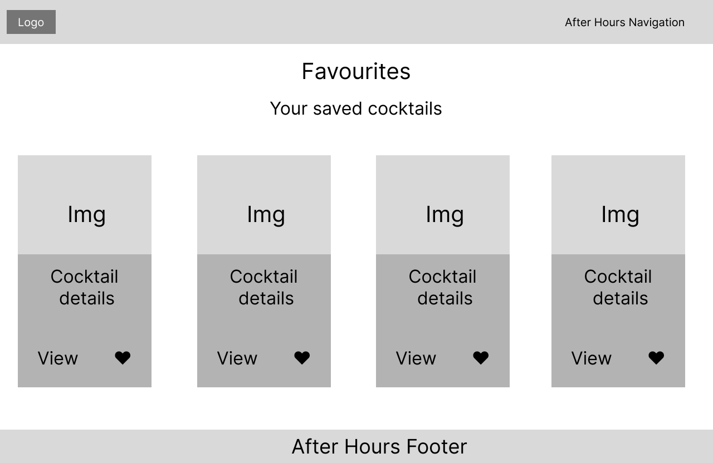

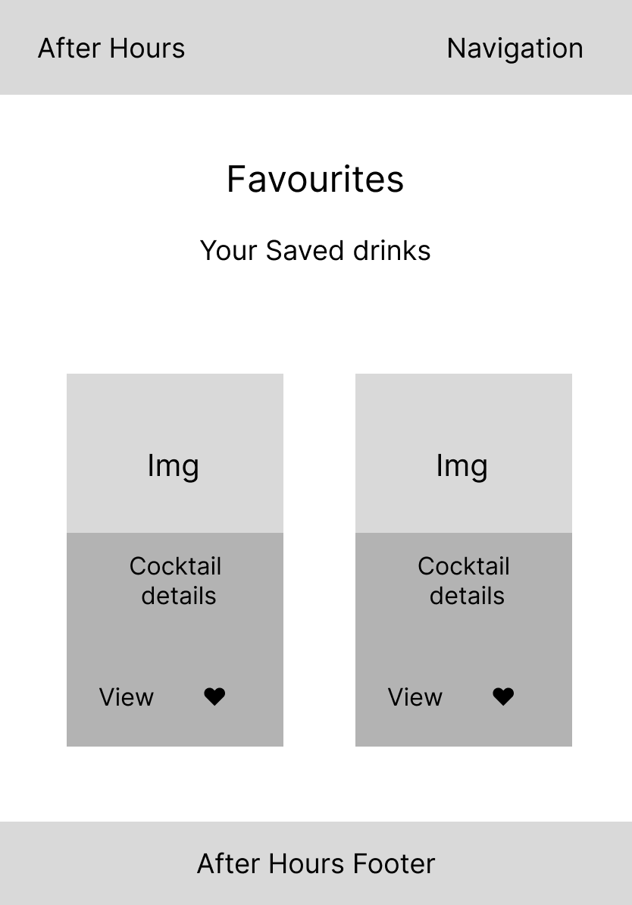

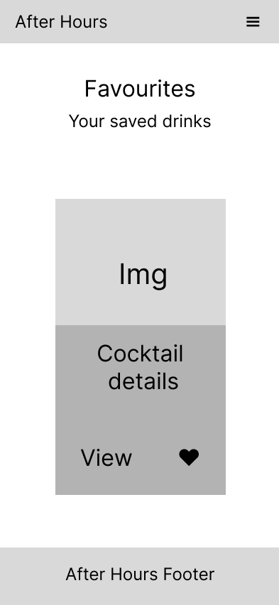

#### Cocktail Details

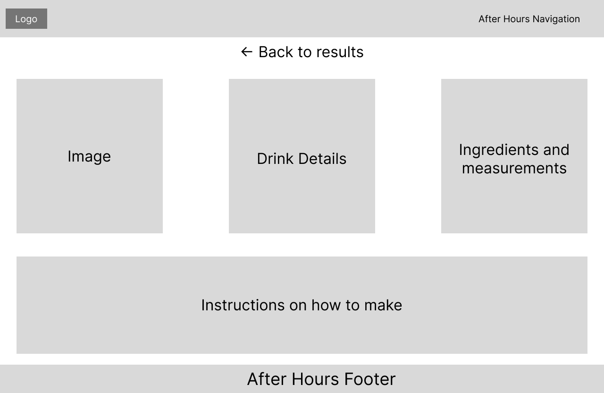

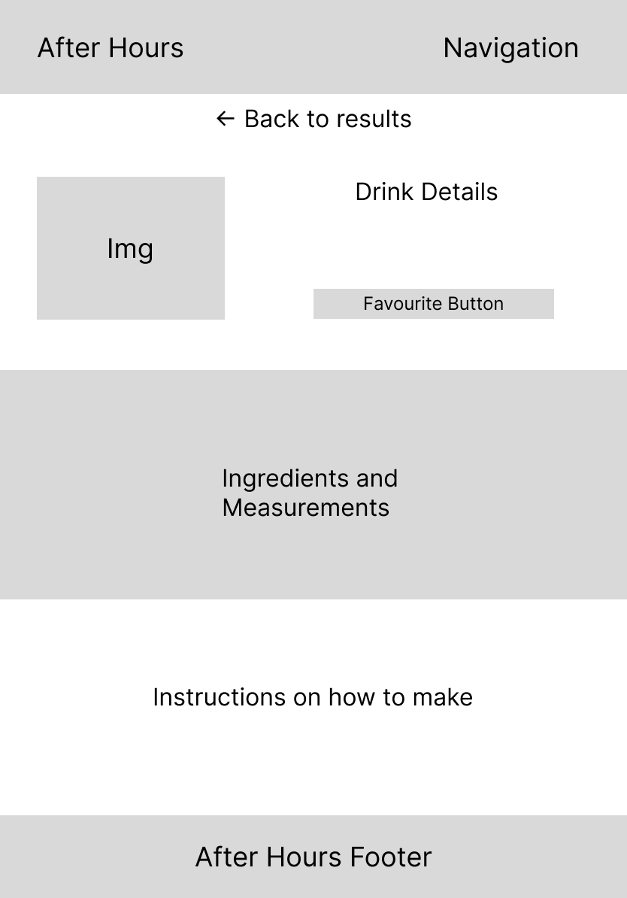

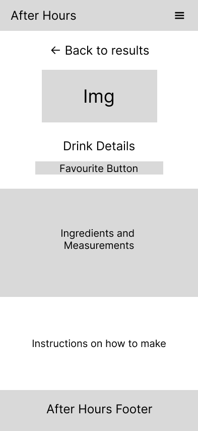

#### Ask The Bartender

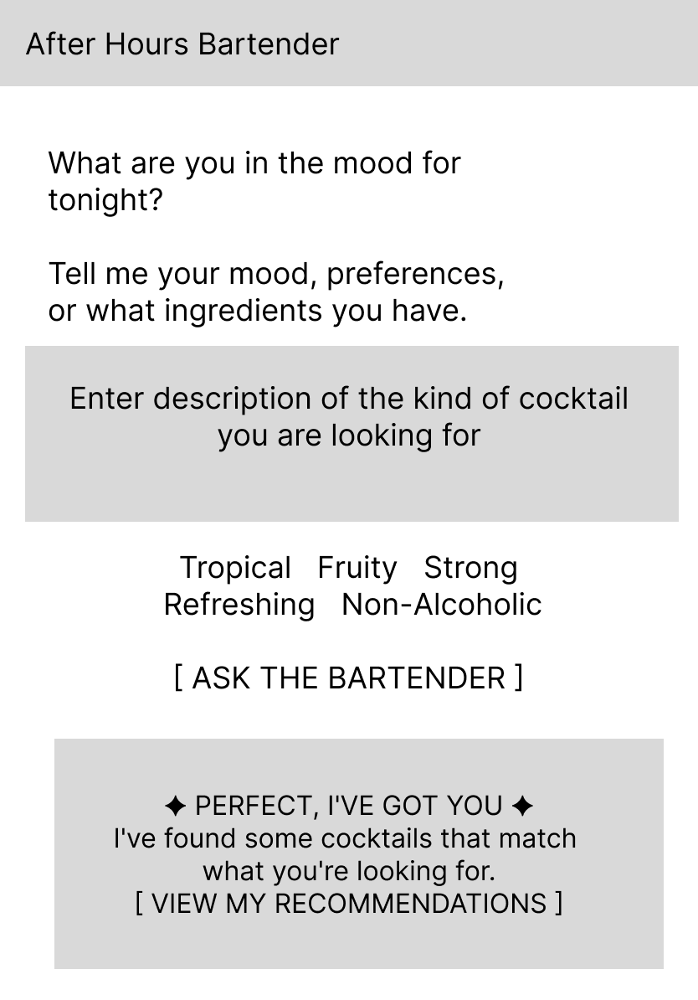

## Features

### Homepage

- Dark, atmospheric hero section introducing the After Hours brand.
- Featured alcoholic cocktails.
- Featured non-alcoholic cocktails.
- Reusable cocktail cards displaying cocktail images, names and information.
- Navigation to the main areas of the website.
- Responsive layout across mobile, tablet and desktop screen sizes.

### Search Cocktails

- Search for cocktails by name using TheCocktailDB API.
- Displays matching cocktail results dynamically.
- Provides feedback when no cocktails are found.
- Responsive results grid across different screen sizes.
- Allows users to view individual cocktail details from the search results.

### My Ingredients

- Allows users to enter ingredients they currently have available.
- Displays added ingredients as removable items.
- Matches selected ingredients against available cocktail data.
- Displays cocktails that can be made using the selected ingredients.
- Uses locally filtered cocktail data to work around limitations of the available API endpoint.
- Allows users to view the details of matching cocktails.

### Cocktail Details

- Displays detailed information for an individual cocktail.
- Shows ingredients and measurements.
- Shows cocktail preparation instructions.
- Uses interactive cards to organise cocktail information.
- Ingredients and instructions can scroll when the content is longer than the available space.

### Favourites

- Allows users to save cocktails they want to revisit.
- Allows users to remove cocktails from their favourites.
- Uses React Context to share favourite state throughout the application.
- Displays saved cocktails on the dedicated Favourites page.

### Ask The Bartender

- Conversational AI bartender powered by Google's Gemini API.
- Provides cocktail recommendations based on the user's preferences and conversation.
- Uses cocktail information from TheCocktailDB as the source for cocktail recommendations.
- Provides alternative ingredient suggestions where appropriate.
- Maintains conversation context during the session.
- Includes quick-pick suggestions to help users start a conversation.
- Includes a standalone Surprise Me button for spontaneous cocktail recommendations.
- Quick Picks can be expanded or collapsed to provide more space for the conversation.
- Provides visual feedback while the bartender is generating a response.
- Keeps the Gemini API key on the server rather than exposing it in the frontend.

### Responsive Design

- Designed and tested across mobile, tablet and desktop breakpoints.
- Uses responsive layouts to adapt content and navigation to different screen sizes.
- Uses separate hero images at different breakpoints where a single image could not maintain a suitable composition.
- Responsive testing was carried out during development rather than only after the site was completed.

## Design

### Concept

The visual concept for After Hours was based around the atmosphere of a dark, luxurious tropical cocktail bar.

The aim was to create the feeling of an evening cocktail experience while keeping the interface clear and easy to navigate.

### Colour Palette

The colour palette was created to support the dark, luxurious tropical cocktail-bar concept.

The main colours include dark neutral backgrounds, gold accents, teal highlights and light text for contrast.

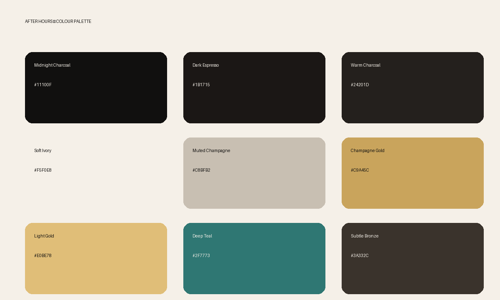

- **Dark neutral tones** are used for the main backgrounds and create the atmospheric bar aesthetic.
- **Gold** is used for headings, borders and interactive elements, inspired by warm metallic details often associated with luxury bar interiors.
- **Teal** provides contrast against the darker background and introduces a tropical colour associated with the sea and cocktails.
- **Light text** provides readability against the dark backgrounds.

### Typography

Three fonts were selected to create a balance between the brand identity and readability.

- **Parisienne** is used for the After Hours wordmark and provides an elegant handwritten style.
- **Playfair Display** is used for headings to reinforce the sophisticated cocktail-bar aesthetic.
- **Poppins** is used for general interface text because of its clean and readable appearance.

### Imagery

The imagery was designed to reinforce the dark and atmospheric theme of the website.

AI-generated imagery was used to create a virtual cocktail-bar environment and supporting page imagery. Cocktail images are brighter and more colourful to provide visual contrast against the darker interface.

Different hero images were created for mobile and larger screens where a single image did not provide an effective composition at every breakpoint.

### Responsive Design

The project was developed and tested across mobile, tablet and desktop screen sizes.

Responsive design was an important part of development because some layouts that worked well on larger screens did not translate effectively to smaller screens.

The layouts were adjusted at different breakpoints to improve positioning, spacing, image composition and readability.

Responsive testing was carried out throughout development, allowing issues to be identified and corrected as individual pages were completed.

## Technologies Used

### Languages

- HTML5
- CSS3
- JavaScript

### Frameworks and Libraries

- React
- React Router
- Font Awesome

### APIs

- TheCocktailDB API — used to retrieve cocktail information.
- Google Gemini API — used to power the conversational AI bartender.

### Development Tools

- Visual Studio Code
- Git
- GitHub
- Chrome DevTools

### Design and Content Tools

- Canva — used for design assets and visual editing.
- Favicon.io — used to create the website favicon.
- AI image generation tools — used to create supporting website imagery.

### Deployment

- GitHub Pages — used to host the React frontend.
- Render — used to host the backend server for the AI bartender.

## Development

The project was developed incrementally, with functionality and responsive design being tested throughout the development process.

### React Development

React was used to create reusable components and manage application state.

A reusable `CocktailCard` component was created so that cocktail information could be displayed consistently across different areas of the website, including featured cocktails, search results, ingredient-based results and favourites.

React state was used for interactive features such as search terms, ingredients, loading states and the AI bartender conversation.

React Context was introduced for the favourites functionality so that favourite cocktail state could be shared between different components and pages.

### API Integration

TheCocktailDB API was used as the main source of cocktail information.

An API limitation affected the My Ingredients feature because the required ingredient-based endpoint was not available in the way needed for the project. To work around this, cocktail data was retrieved alphabetically and filtered within the application based on the ingredients entered by the user.

This allowed the feature to provide ingredient-based cocktail matching while remaining within the available API functionality.

### AI Bartender Development

The AI bartender was initially considered a future development feature rather than part of the core project scope. As development progressed, it became clear that a conversational bartender could complement the cocktail discovery features and provide an additional way for users to interact with the application.

The feature was therefore brought into the project at a later stage and developed as an extension of the existing cocktail discovery functionality.

Google Gemini was selected to provide the conversational element of the bartender. The Gemini API is accessed through a separate server so that the API key is not exposed in the frontend.

The AI bartender was designed to work alongside TheCocktailDB rather than independently generating cocktail information. Cocktail data is supplied to the server so that recommendations can be based on cocktails available through the application's data source.

The bartender also provides alternative ingredient suggestions where appropriate and maintains the conversation context during a session.

### Responsive Development

Responsive design was developed and tested throughout the project.

Initial layouts were adapted at different breakpoints after testing revealed that some desktop layouts and imagery did not translate effectively to smaller screens.

Separate hero images were created for mobile and larger screens where necessary. CSS media queries were then used to adjust positioning, sizing, spacing and layout at different breakpoints.

### Debugging and Problem Solving

A number of development challenges were encountered during the project, including:

- Learning React while continuing to develop JavaScript knowledge.
- Managing state across multiple components.
- Implementing favourites using React Context.
- Working around limitations of the CocktailDB API.
- Connecting the Gemini AI service to the cocktail data.
- Handling temporary Gemini API availability and rate-limit issues.
- Resolving responsive layout and image-positioning problems.
- Debugging component behaviour and browser console errors.
- Ensuring shared CSS did not unintentionally affect unrelated components.

Development involved testing, debugging and refining features throughout rather than waiting until the end of the project.

## Testing

Testing was carried out throughout development to identify functional, responsive, accessibility and validation issues before submission.

[View Testing & Validation Evidence →](TESTING.md)

## Deployment

The frontend of After Hours is deployed using GitHub Pages, while the backend server used by the AI bartender is hosted separately using Render.

### Frontend Deployment

The React application is hosted on GitHub Pages.

The project uses Vite and is configured with the GitHub Pages base path so that React Router works correctly when the application is hosted under the repository path.

A GitHub Actions workflow is used to build and deploy the frontend.

The Gemini API URL is supplied through a GitHub Actions secret rather than being hard-coded into the application.

### Backend Deployment

The backend server is deployed to Render.

The server handles communication with the Gemini API so that the Gemini API key is not exposed in the frontend application.

The Gemini API key is stored as an environment variable in Render.

### Deployment Process

The deployment workflow is:

1. Changes are committed and pushed to GitHub.
2. GitHub Actions builds the React application.
3. The production frontend is deployed to GitHub Pages.
4. The frontend communicates with the deployed backend on Render.
5. The backend communicates with the Gemini API.

Environment variables and API keys are kept out of the public repository.

## Credits

### APIs and Services

- [TheCocktailDB](https://www.thecocktaildb.com/) — provided the cocktail data used throughout the application.
- [Google Gemini](https://ai.google.dev/) — used to power the conversational AI bartender.
- [GitHub Pages](https://pages.github.com/) — used to host the frontend application.
- [Render](https://render.com/) — used to host the backend server.

### Development Resources

- [React](https://react.dev/) — frontend framework.
- [React Router](https://reactrouter.com/) — client-side routing.
- [Font Awesome](https://fontawesome.com/) — icons used throughout the application.
- [Google Fonts](https://fonts.google.com/) — typography.
- [Favicon.io](https://favicon.io/) — used to create the website favicon.

### Design and Imagery

AI image generation was used to create the atmospheric hero imagery and supporting visual assets used throughout the website.

Canva was used to create and edit visual assets.

### Development Support

The project was developed with support from a developer friend who provided advice and guidance during development, particularly when working through technical problems and implementation decisions regarding AI bartender.

ChatGPT was also used as a development mentor throughout the project. It was used to help explain JavaScript and React concepts, troubleshoot errors, discuss implementation approaches, and support debugging and responsive design decisions.

The project code, design decisions and final implementation were developed and reviewed by the student.

## Future Development

Although the main functionality of After Hours has been implemented, several improvements could be considered for future versions.

### Preserving Search and Ingredient Results

When navigating from Search Cocktails or My Ingredients to a cocktail's Details page, the previous results are not currently preserved when returning to the original page.

A future version could preserve the user's search term, selected ingredients and results when navigating between pages.

### Expanded Cocktail Data

The application could be expanded to provide additional cocktail information, such as more detailed categories, glassware information, flavour profiles and cocktail history where suitable data is available.

### Improved Favourites

The current favourites feature stores the user's favourites within the application. A future version could allow users to create an account and synchronise their favourites across devices.

### AI Bartender Improvements

The AI bartender could be expanded with additional conversational features, more detailed preference handling and further ingredient substitution options.

### Additional Accessibility Improvements

Further accessibility testing could be carried out with assistive technologies such as screen readers and keyboard-only navigation.

### Performance Optimisation

Further optimisation could be carried out as the application grows, particularly around API requests, image loading and the amount of cocktail data processed by the application.

## Reflection

### What I Learned

Developing After Hours has significantly improved my understanding of JavaScript and introduced me to developing a larger application using React. At the beginning of the project, I was still relatively new to JavaScript, so learning React at the same time was challenging. There were many concepts that I initially found confusing, particularly when several new concepts had to be used together.

One area I now feel particularly comfortable with is creating React components. I have a much better understanding of why components are used and how breaking an application into smaller, reusable sections makes the code easier to manage. I also became more comfortable connecting components to the main application and passing information between them.

I would not currently feel confident recreating the entire After Hours application independently without support. A significant amount of development involved learning unfamiliar concepts, debugging problems and receiving guidance from both ChatGPT and a developer friend. However, I feel that the project has given me a much stronger foundation in React and JavaScript and has shown me which areas I need to continue practising.

As the project progressed, I also began creating a personal React Dummies Guide based on the concepts I had learned during development. The purpose of this guide was to create a practical reference that I could use when starting another React project, rather than having to rely on remembering everything from After Hours.

Creating the guide helped me recognise which concepts I understood and which areas still needed more practice. It also encouraged me to think about the reasoning behind the code rather than only remembering the final solution.

I also became more aware of the importance of using documentation when working with unfamiliar technologies. During development I used documentation and reference material for technologies and services including React, React Router, TheCocktailDB and Google Gemini. This helped me understand how different features were intended to work and gave me a reference point when troubleshooting problems. I found that combining documentation with practical experimentation and mentoring was more useful than relying on one source of information alone.

### Challenges and Problem Solving

One of the biggest challenges throughout the project was working with APIs. Using TheCocktailDB introduced me to retrieving external data and working with the limitations of a third-party service. The My Ingredients feature was particularly challenging because the available API functionality did not provide exactly what was required, meaning I had to find another way of achieving the functionality within the limitations of the API.

The AI bartender was the most challenging part of the project. It required me to work with Google Gemini while also connecting it to the cocktail data used by the application. I had to understand the difference between the frontend and backend, keep the API key secure, manage the conversation context and handle responses from the AI service.

I would not have been able to implement the AI bartender independently at this stage of my learning. I received significant support from a developer friend as well as mentoring from ChatGPT while working through the implementation. The feature involved several concepts that were new to me, and having these sources of support helped me understand what was happening rather than simply abandoning the feature when I became stuck.

I also encountered temporary API rate-limit and availability problems while developing and testing the feature. These problems required further debugging and changes to the way requests were handled, including adding retry handling for temporary service errors.

Debugging was another major part of the development process. Problems were not always caused by the part of the application I was initially looking at, which meant I had to become more comfortable reading console errors, tracing problems and testing changes rather than simply assuming where the issue was.

Responsive design also required more problem solving than I initially expected. Some layouts appeared correct when tested at a particular viewport size but behaved differently when the actual browser window was resized. This taught me that responsive testing needs to involve more than checking a few fixed screen sizes.

### What Went Well

One of the most positive aspects of the project was being able to take the concepts I had been learning and use them to create a complete application rather than isolated exercises.

Creating reusable components, particularly the shared cocktail card, helped me understand the practical benefits of React. Instead of recreating the same structure for different pages, the same component could be reused with different cocktail information.

I also became more confident with debugging as the project progressed. Although I still needed support when dealing with unfamiliar problems, I became better at identifying what was happening and understanding the reason behind the changes being made.

The project also gave me experience of working with technologies that I had not previously used together, including React, external APIs, React Context and an AI API with a separate backend.

### What I Would Do Differently

If I were starting the project again, I would spend more time planning how the different parts of the application would work together before beginning development. Although the project was planned using user stories and wireframes, some technical decisions became clearer only after development had started.

One decision I would reconsider is whether to use a CSS framework such as Bootstrap. I chose to build the responsive layouts mainly using my own CSS and media queries, which gave me more control over the final design but also resulted in a significant amount of time being spent working on grids, spacing, sizing and responsive behaviour. After experiencing these challenges, I can see how using Bootstrap for some of the layout and responsive structure could have made development easier and reduced some of the repetitive CSS.

I would also allow more time for learning React concepts before moving into some of the more complicated features. Learning React while still developing my JavaScript knowledge sometimes made problems harder to understand because I was trying to learn several things at once.

The AI bartender would also be approached differently if I were starting again. It was the most technically challenging feature and required considerably more development and debugging than I initially expected. Having a clearer understanding of the frontend, backend and API communication before beginning this feature would make the development process easier.

Although I would consider using Bootstrap for some aspects of a future project, I would still want to use custom CSS where it was needed to achieve the specific visual design and user experience I wanted.

### Overall Reflection

Overall, After Hours has been a challenging project but has given me a much better understanding of what is involved in developing a React application.

I have not reached the point where I could independently recreate the entire project from scratch, but I have developed a stronger foundation that I can continue building on. In particular, I now feel comfortable creating React components and understand why they are important when developing a React application.

The project has also shown me that understanding how to debug and solve problems is just as important as knowing the syntax itself. There were many occasions where the solution was not immediately obvious, but working through these problems helped me understand the technologies better.

Going forward, I would like to continue developing smaller React projects so that I can practise the concepts I have learned without relying as heavily on guidance. The React Dummies Guide I created alongside this project will give me a practical reference when doing this. My aim is to gradually become more confident at solving problems independently while continuing to use the skills and understanding I developed during After Hours.

## AI Mentoring Evidence

AI was used as a learning and development aid throughout this project. It helped me understand unfamiliar React concepts, troubleshoot problems and explore ways to implement new functionality. I reviewed and tested the suggested solutions before incorporating them into my project.

### Understanding React Components and Props

AI helped me understand how React components communicate through props and how to apply these concepts when building reusable components.

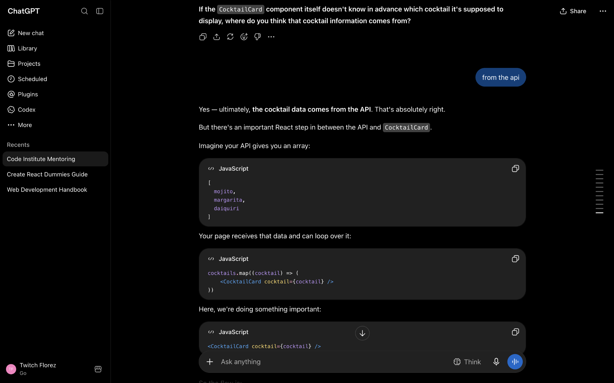

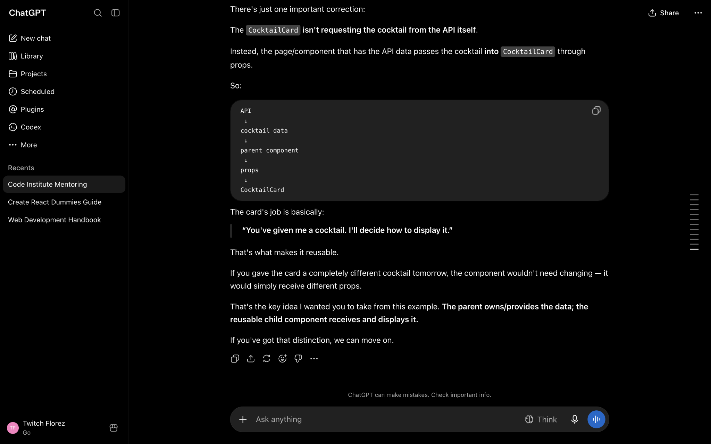

### Developing My Ingredients

AI helped me work through the process of retrieving cocktail data from TheCocktailDB and filtering recipes based on ingredients selected by the user.

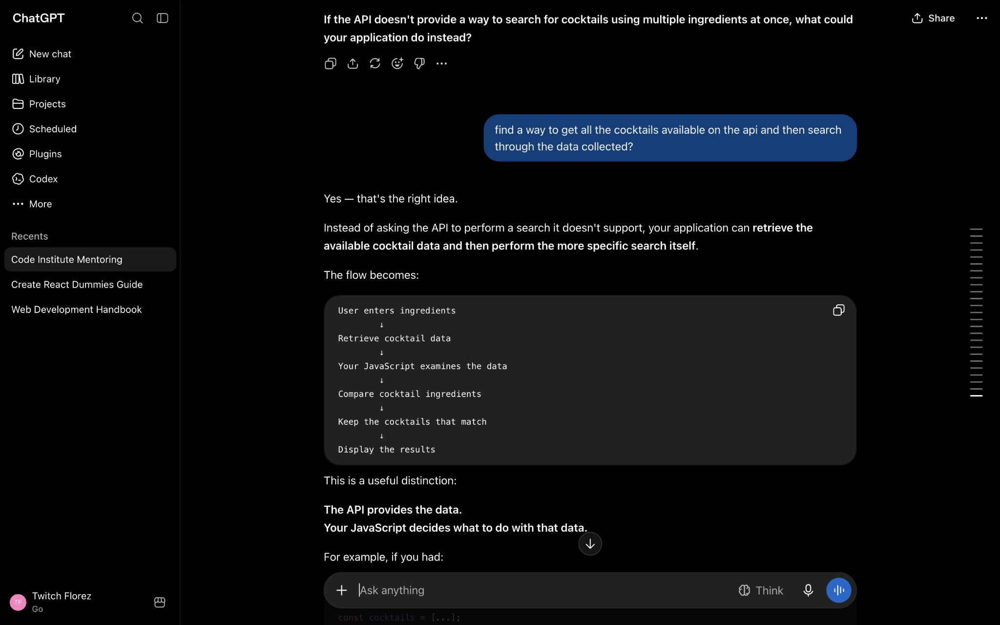

### Securing the Gemini API

AI helped me understand why API keys should not be exposed in frontend code and how to use a Node/Express backend to handle Gemini API requests.

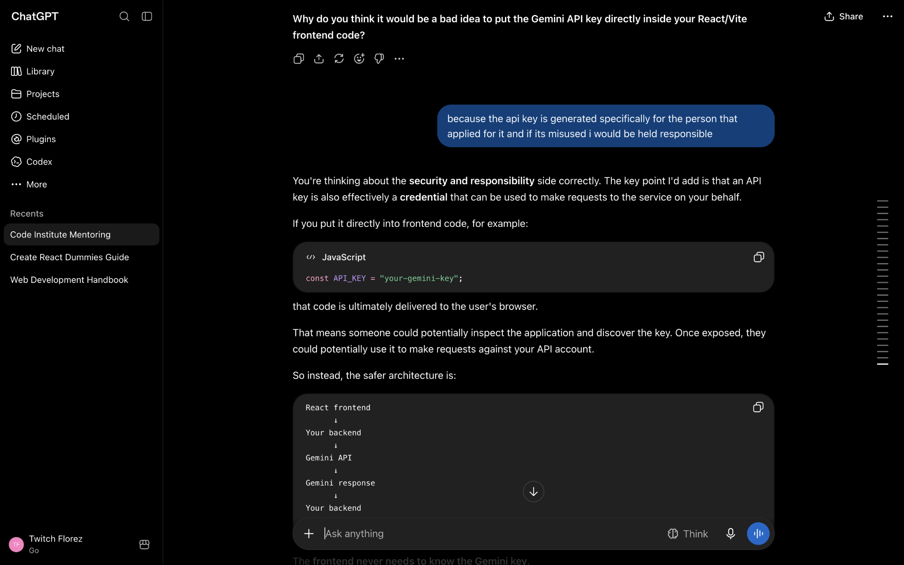

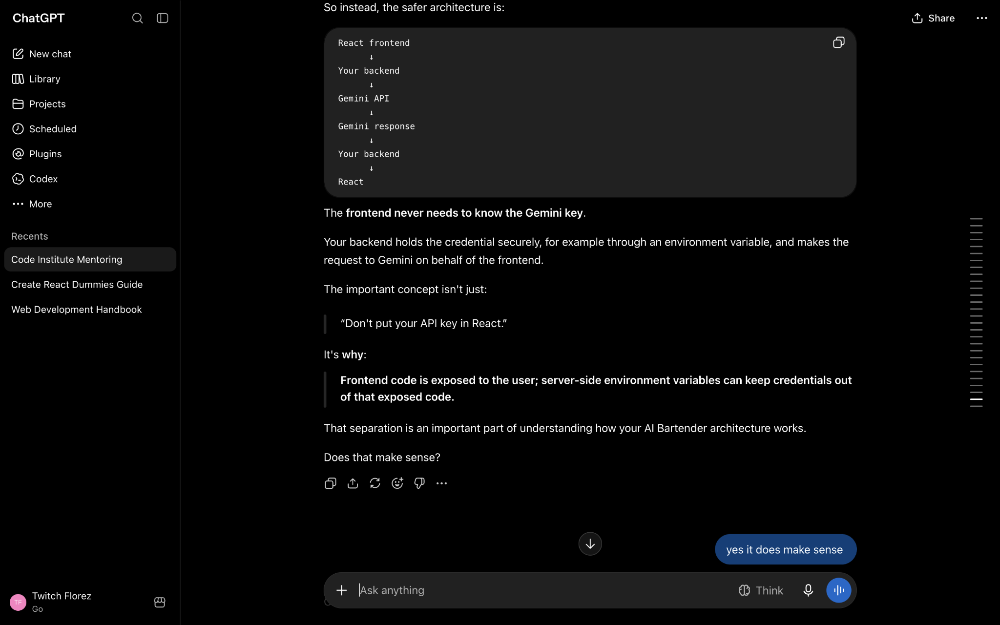