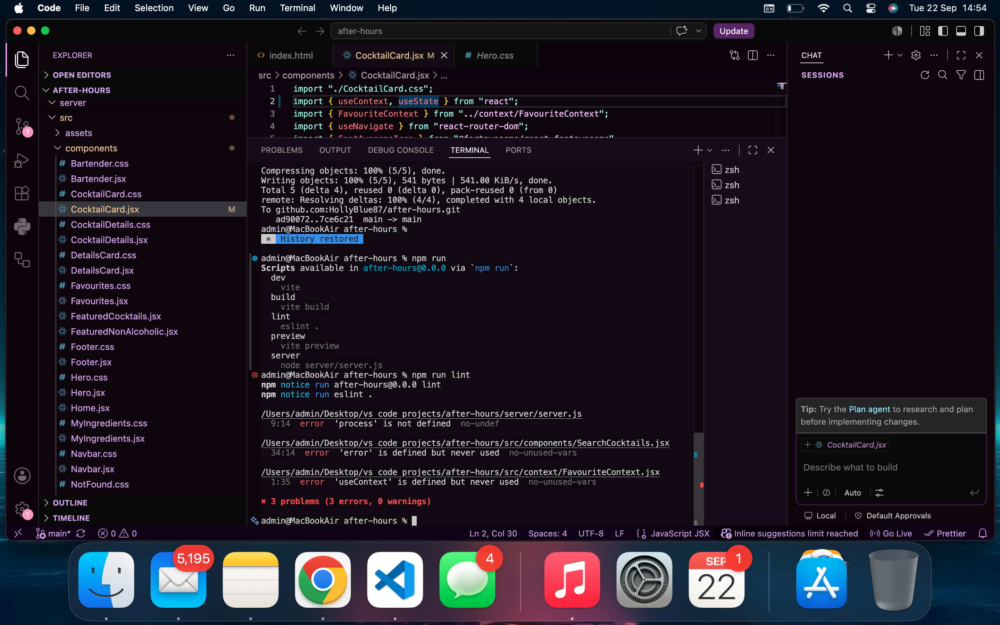
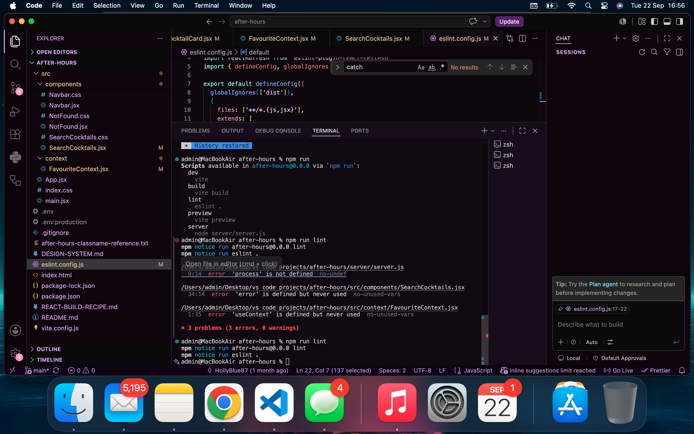
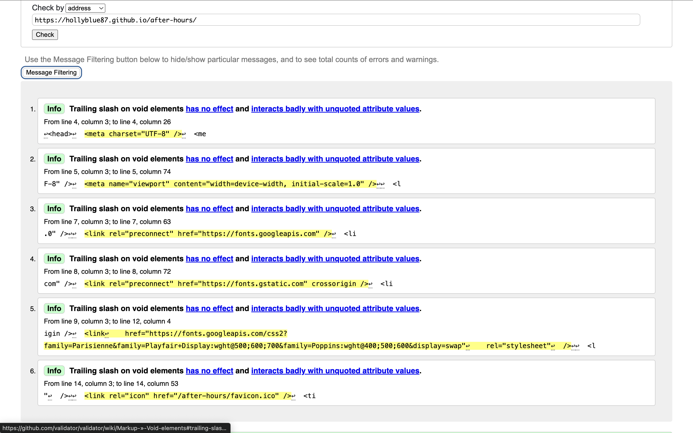
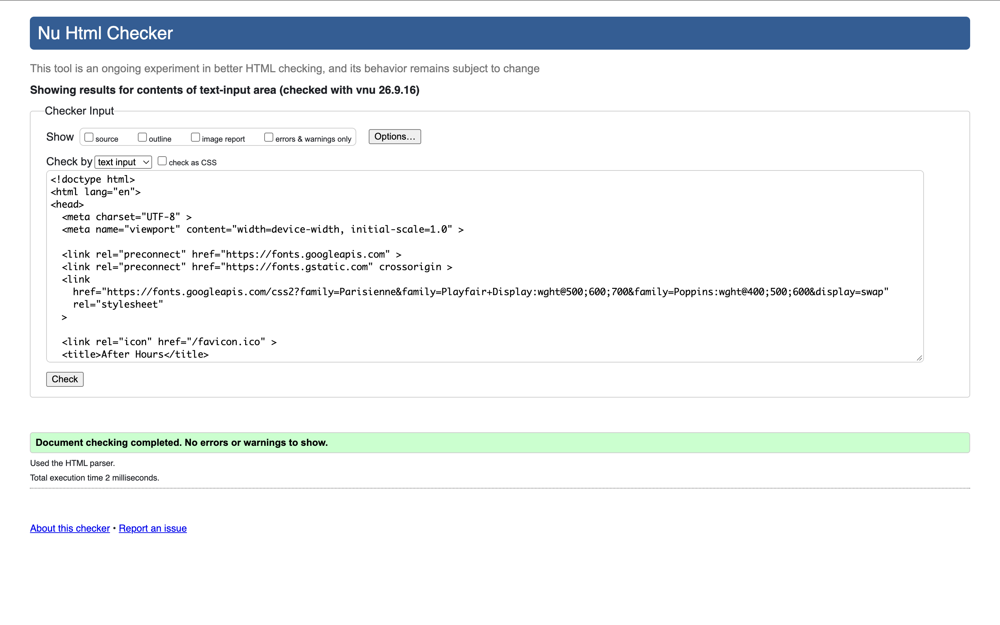
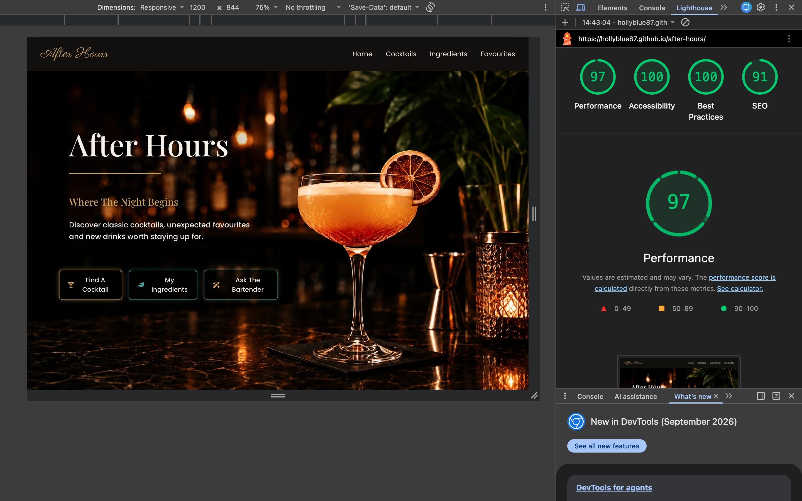
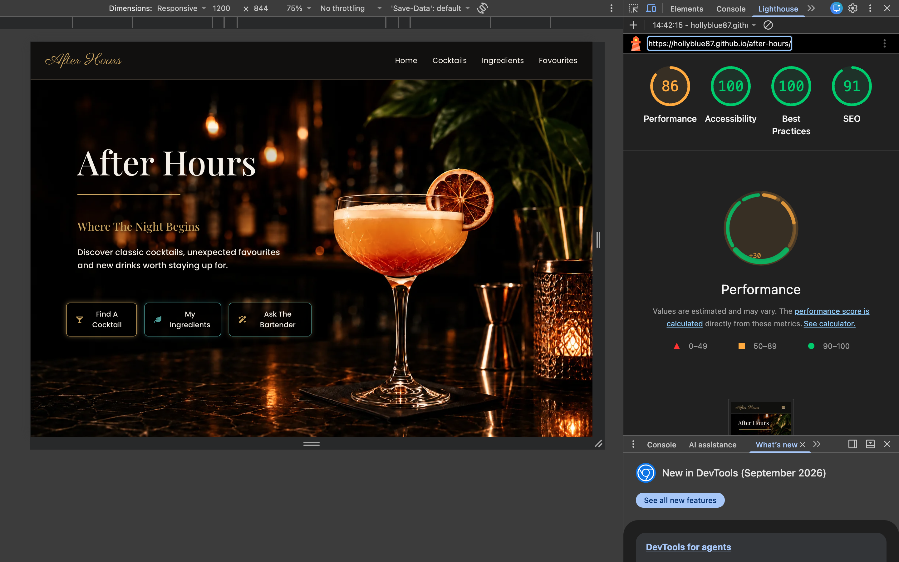
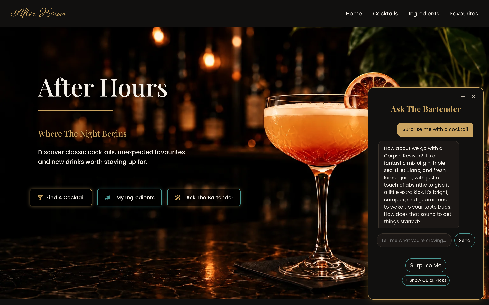

# Testing & Validation Evidence

## 1. JavaScript Validation — ESLint

The JavaScript and JSX code was validated using ESLint.

The final lint check was completed using:

`npm run lint`

The validation completed with no errors or warnings.

**Result: Pass**

### ESLint Evidence

## 2. HTML Validation

The HTML was validated using the W3C Markup Validation Service.

The final validation was completed after correcting the trailing slashes on HTML void elements in `index.html`.

**Result: Pass**

The CSS was validated using the W3C CSS Validation Service.

Each stylesheet used by the project was validated individually.

All CSS validation errors were corrected before final testing. One validation error was identified in `Footer.css`, where the `margin` value was missing a unit. This was corrected from `margin: -0.5;` to `margin: -0.5rem;`.

The validator also reported a warning relating to CSS custom properties. This was not a CSS validation error and did not prevent the stylesheet from passing validation.

**Result: Pass**

### Validated Stylesheets

| Stylesheet | Result | Evidence |
|---|---|---|
| `Index.css` | Pass | [View screenshot](src/assets/readme/testing/index-css-validator.png) |
| `Navbar.css` | Pass | [View screenshot](src/assets/readme/testing/navbar-css-validator.png) |
| `Hero.css` | Pass | [View screenshot](src/assets/readme/testing/hero-css-validator.png) |
| `CocktailCard.css` | Pass | [View screenshot](src/assets/readme/testing/cocktailcard-css-validator.png) |
| `SearchCocktails.css` | Pass | [View screenshot](src/assets/readme/testing/searchcocktails-css-validator.png) |
| `MyIngredients.css` | Pass | [View screenshot](src/assets/readme/testing/myingredients-css-validator.png) |
| `Favourites.css` | Pass | [View screenshot](src/assets/readme/testing/favourites-css-validator.png) |
| `DetailsCard.css` | Pass | [View screenshot](src/assets/readme/testing/detailscard-css-validator.png) |
| `CocktailDetails.css` | Pass | [View screenshot](src/assets/readme/testing/cocktaildetails-css-validator.png) |
| `Bartender.css` | Pass | [View screenshot](src/assets/readme/testing/bartender-css-validator.png) |
| `Footer.css` | Pass | [View screenshot](src/assets/readme/testing/footer-css-validator-error.png) |
| `NotFound.css` | Pass | [View screenshot](src/assets/readme/testing/notfound-css-validator.png) |

## 4. Lighthouse Testing

Lighthouse was used to evaluate the website's performance, accessibility, best practices and search engine optimisation.

Testing was carried out using the mobile Lighthouse audit after the final performance and accessibility improvements.

### Final Lighthouse Results

| Category | Score |
|---|---:|
| Performance | 86 |
| Accessibility | 100 |
| Best Practices | 100 |
| SEO | 91 |

**Result: Pass**

The final mobile Lighthouse run achieved a score of 100 for Accessibility and Best Practices. Performance and SEO were also assessed as part of the final audit.

## 5. Manual Testing

Manual testing was carried out on the final deployed version of the website to confirm that the main user journeys and interactive features worked as expected.

| Feature / Action | Expected Result | Actual Result | Status |
|---|---|---|---|
| Homepage | Homepage loads correctly and displays the hero and featured cocktail sections. | Homepage loaded correctly and all main content displayed as expected. | Pass |
| Desktop navigation | Navigation links open the correct pages. | All navigation links worked correctly. | Pass |
| Mobile navigation | Hamburger menu opens, closes and allows navigation. | Mobile navigation worked correctly. | Pass |
| Search — initial state | Search page displays the intended empty state. | Empty state displayed correctly. | Pass |
| Search — valid search | Searching for a known cocktail displays matching results. | Matching results were displayed correctly. | Pass |
| Search — no results | An unsuccessful search displays appropriate feedback. | No-results message displayed correctly. | Pass |
| Cocktail card | Selecting a cocktail card reveals its ingredients. | Cocktail cards flipped and displayed ingredients correctly. | Pass |
| Cocktail Details | Correct cocktail information, ingredients and instructions are displayed. | Cocktail details displayed correctly. | Pass |
| My Ingredients — initial state | Initial page displays the intended empty state without an unnecessary action button. | Empty state displayed correctly and the Find My Cocktails button remained hidden until an ingredient was added. | Pass |
| My Ingredients — add ingredient | Entered ingredients are added to the ingredient list. | Ingredients were added correctly. | Pass |
| My Ingredients — remove ingredient | Selected ingredients can be removed. | Ingredients were removed correctly. | Pass |
| My Ingredients — find cocktails | Matching cocktails are displayed based on the selected ingredients. | Matching cocktails were displayed correctly. | Pass |
| Favourites — add | A cocktail can be added to Favourites. | Cocktails were added correctly. | Pass |
| Favourites — remove | A cocktail can be removed from Favourites. | Cocktails were removed correctly. | Pass |
| Favourites — re-add | A removed cocktail can be added again. | Cocktails could be re-added correctly. | Pass |
| Details-page favourite | Favourite status can be changed from the Cocktail Details page. | The favourite heart worked correctly and remained synchronised with Favourites. | Pass |
| Footer navigation | Footer links navigate to the correct pages and scroll appropriately. | Footer links worked correctly. | Pass |
| 404 page | An invalid URL displays the custom Not Found page. | Custom 404 page displayed correctly. | Pass |
| Back to Bar | The Back to Bar button returns the user to the homepage. | Button returned to the homepage correctly. | Pass |

### External Service Testing — Ask The Bartender

The Ask The Bartender feature was tested as part of the final manual testing process.

The bartender interface, conversation input, loading state, minimise/restore controls and error handling were all tested successfully.

During the final regression test, the Gemini API returned a `503 Service Unavailable` response. The application handled this correctly by displaying its fallback message rather than failing or exposing an error to the user.

Earlier functional testing confirmed that successful Gemini responses could be received from the deployed application.

Because the Gemini API is an external service, its availability is outside the control of the application.

### Surprise Me

The standalone Surprise Me button was tested on desktop
and mobile. It successfully replaces any existing chat
input with a surprise cocktail request.

A successful recommendation was also received from the
Gemini API, confirming that the feature works end to end.

**Result: Pass — error handling verified; external API availability noted as a limitation.**

## 6. Known Testing Limitations

The project relies on external services for some functionality. TheCocktailDB and Gemini API availability can affect features that depend on their responses.

During final testing, the Gemini API temporarily returned `503 Service Unavailable` responses. The application handled these responses using its fallback error message. The project uses the free tier of the Gemini API, and intermittent service availability was a recurring limitation during development and testing.

The final validation and manual testing results therefore reflect both the application's own behaviour and the availability of the external services at the time of testing.
